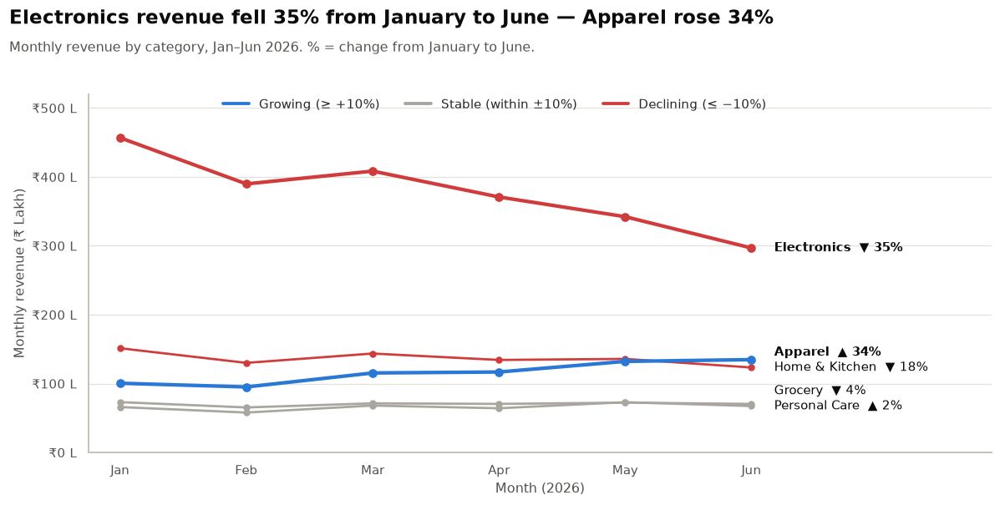
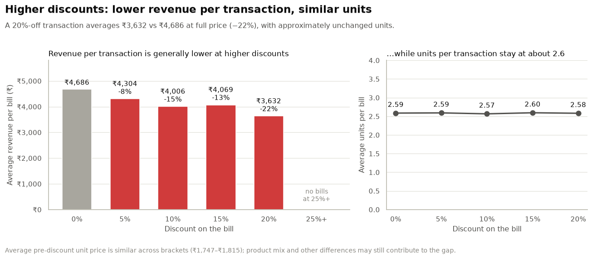

# MUC01 — Category Intelligence: Retail Product Performance EDA

**Group 10** · Calibo AI Academy · Path 2 · KLU Batch · Phase 1 — Mini Use Case 01
Mohammed Saalif Udyawar · Jakkana Hasini · Mohammed Mutee Ruknuddin

> **Business question:** Based on six months of transaction data (Jan–Jun 2026, 12 stores in Andhra Pradesh), which product categories are growing or declining, which products are driving performance, and what should the Category Manager prioritise or deprioritise going into the supplier review?

---

## Submission at a glance

| Assignment requirement (group) | File |
|---|---|
| One shared Jupyter Notebook covering all six steps, each step credited to its owner | [`Group10_MUC01_KLU_Notebook.ipynb`](Group10_MUC01_KLU_Notebook.ipynb) |
| CBIM Problem Canvas | At the top of the notebook |
| 1-page insight summary (≤ 500 words) with section ownership | [`Group10_MUC01_KLU_Summary.pdf`](Group10_MUC01_KLU_Summary.pdf) |
| Individual 150-word reflection from each member | [`reflections/`](reflections/) |
| Dataset, beside the notebook | [`MUC01_Retail_Sales_Dataset.csv`](MUC01_Retail_Sales_Dataset.csv) |

**Additional material (not required by the brief):**

| File | What it is |
|---|---|
| [`presentation/`](presentation/) | 10-slide deck (`.pptx`, with presenter scripts in the speaker notes, plus a `.pdf` copy) |
| [`supporting/Group10_MUC01_KLU_Decisions.pdf`](supporting/Group10_MUC01_KLU_Decisions.pdf) | Optional decisions playbook: category, product, stock, discount and store actions. Findings and proposed management choices are labelled separately. |
| [`supporting/Group10_MUC01_KLU_Decisions_Calculations.ipynb`](supporting/Group10_MUC01_KLU_Decisions_Calculations.ipynb) | Reproduces every figure in the decisions playbook (sections C1–C8) |
| [`visualizations/`](visualizations/) | The eight notebook charts as PNG files, named by step |

---

## Key findings

**1. Electronics revenue fell 35% and accounts for the chain's decline.**
Electronics is 49% of revenue; its monthly revenue fell from ₹4.57 Cr (January) to ₹2.97 Cr (June). The chain fell 18%, while the other four categories together grew 1.3%. Electronics transactions fell 33% with prices nearly flat (−2%). The data does not establish whether the cause is stock availability, competition, pricing or demand. Mobile Phone fell the most: ₹98.0 lakh → ₹42.1 lakh (−57%).



**2. Apparel is the growth category.** Revenue rose 34% (₹1.01 Cr → ₹1.35 Cr), with all five products up and recorded transactions +31%. Customer and seasonal data are needed to explain why.

**3. Deeper discounts do not come with bigger baskets.** Higher discounts are associated with lower revenue per transaction (₹4,686 at full price vs ₹3,632 at 20% off) without a meaningful increase in units (≈ 2.6 at every level). This supports challenging deeper discounts, but does not establish their effect on total demand or profit.



**Recommendation:** back Apparel with more shelf space and stock; challenge the Electronics supplier, starting with Mobile Phones; trial a 10% cap on store-funded discounts and test weekday promotions; obtain product cost and margin data before any delisting decision.

---

## How to run

1. Keep **`MUC01_Retail_Sales_Dataset.csv`** in the repository root, next to the notebook, with exactly this file name.
2. Use **Python 3.12** and install the tested versions:
   ```bash
   pip install -r requirements.txt
   ```
   Tested with Python 3.12.3 · pandas 3.0.5 · NumPy 2.5.2 · Matplotlib 3.11.1 · Seaborn 0.13.2 · Jupyter 1.1.1 · ipykernel 7.3.0.
3. Open `Group10_MUC01_KLU_Notebook.ipynb` and choose **Kernel → Restart Kernel and Run All Cells**. It runs end to end in under a minute, and the setup cell prints the library versions in use. From the command line:
   ```bash
   jupyter nbconvert --to notebook --execute --inplace Group10_MUC01_KLU_Notebook.ipynb
   ```
4. Optionally, run `supporting/Group10_MUC01_KLU_Decisions_Calculations.ipynb` the same way. It reads the dataset from the repository root.

The notebooks are committed with outputs from a clean run.

---

## Team and roles

| Member | Role | Notebook sections | Presentation |
|---|---|---|---|
| Mohammed Saalif Udyawar | Data Analyst | CBIM Problem Canvas (with the team) · Steps 6.1, 6.2, 6.3 | Slides 1–6 |
| Jakkana Hasini | Insights Lead | Step 6.5 | Slide 7 |
| Mohammed Mutee Ruknuddin | Business Synthesiser | Setup and chart style · Steps 6.4, 6.6 · notebook integration | Slides 8–10 |

Each section was run and checked by a member who did not write it.

---

## Repository structure

```
.
├── Group10_MUC01_KLU_Notebook.ipynb        # main submission
├── Group10_MUC01_KLU_Summary.pdf           # 1-page insight summary
├── MUC01_Retail_Sales_Dataset.csv          # supplied dataset
├── requirements.txt
├── reflections/                            # one 150-word reflection per member
├── presentation/                           # slides (.pptx + .pdf)
├── supporting/                             # optional decisions playbook + calculations
└── visualizations/                         # chart PNGs, named by step
```
